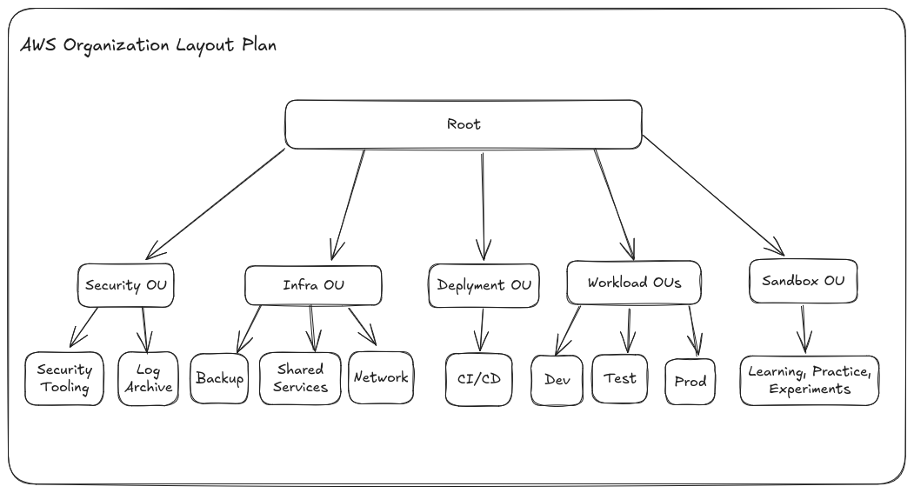

# AWS Organization Terraform

My AWS Organization deployment with Terraform. SSO setup and permission sets done manually for now.

## Plan

- Admin: Manages organization
  - Workload: Application and data environments
    - Dev: Write/test code
    - Testing: Testing/staging dev changes before production
    - Production: Released application + data
  - Infrastructure: Shared infrastructure services (backups, network (eg. Route 53), monitoring, etc.)
  - Security: Logs (CloudTrail, VPC flow logs), security tooling
  - Sandbox: Experiment/test AWS services, learning, etc.
  - Deployments: CI/CD services

Reference:

- [AWS Organizations Whitepaper](https://docs.aws.amazon.com/whitepapers/latest/organizing-your-aws-environment/recommended-ous-and-accounts.html)
- [Managing Your Game Studio on AWS](https://aws.amazon.com/blogs/gametech/managing-your-game-studio-on-aws-part-1/)

## Setup

- Important Note: Organization has quota of 10 accounts, can try to increase quota before creating organization
- Setup appropriate Terraform backend, edit variables to create appropriate accounts, emails, and email domain
- Enable and setup SSO manually after creating organization and set appropriate permission sets
- Optionally setup S3+DynamoDB Terraform state backend with Cloudformation, my setup [here](https://github.com/jamesyoung-15/aws-terraform-s3-backend).

## Notes

This is for myself, useful for fast creation of organization and accounts, but not good for deletion of accounts or the whole organization.

Removing accounts from organization is not convenient if created through Terraform. The accounts need to be setup for standalone before removing from organization, meaning that each account needs to be logged in and setup accordingly. 

Even after standalone setup, leaving organization has a 7 day cooldown period.

Closing account is possible through Terraform, but if the accounts aren't setup for standalone, it will be suspended which means either have to wait 90 days for it to get closed before removing it out of organization or contacting support.
